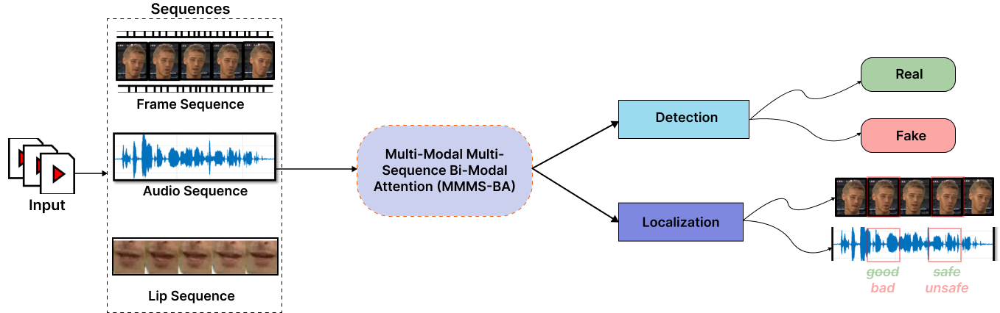
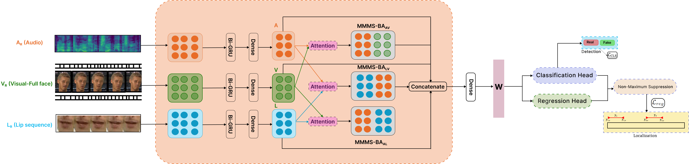

# Contextual Cross-Modal Attention for Audio-Visual Deepfake Detection and Localization
[Research Paper](https://github.com/vcbsl/Audio-Visual-Deepfake-Detection-Localization/)
## Table of Contents
- [Overview](#overview)
- [Methodology](#methodology)
- [Key Contributions](#key-contributions)
- [Datasets](#datasets)
- [Requirements](#requirements)
- [Citation](#citation)
- [License](#license)
## Overview
In the digital age, the rise of deepfakes and synthetic media presents significant threats to societal and political integrity. Due to their increased realism, deepfakes manipulating multiple modalities, such as audio and visual, are especially concerning. Existing unimodal deepfake detectors are primarily designed to detect a single type of manipulation, such as visual, acoustic, and text. Whereas, multi-modal deepfake detectors are being investigated to detect and localize multi-modal manipulations. Current approaches for audio-visual deepfake detection utilizing attention-based fusion  stem from the heterogeneous nature of audio and visual signals. Consequently, the unique capabilities of each modality (modality-specific features) are not utilized effectively in the fusion process. 

## Limitations of existing multi-modal deepfake detectors
 Current multi-modal deepfake detectors, which often rely on attention-based fusion of heterogeneous data streams, face several limitations:
- **Modality-Specific Features Not Utilized**: The unique capabilities of each modality (audio and visual) are not fully leveraged in the fusion process.
- **Noise Sensitivity**: Noise in one modality can degrade the overall performance of the multi-modal framework.
- **Lack of Explicit Modeling of Inter-Modality Interactions**: The relationship between different modalities, such as audio, full face, and lip movements, is not explicitly modeled, leading to inadequate capture of correlation and dependencies.
- **Missing Contextual Information Utilization**: Current methods do not incorporate consistent and meaningful patterns across sequences within and across modalities.
- **Lack of Integrated Deepfake Detection and Localization Mechanisms**: Most approaches focus solely on detection without localizing manipulated segments.
  
Our project proposes a recurrent neural network-based multi-modal multi-sequence attention framework, called Multi-Modal Multi-Sequence Bi-Modal Attention (MMMS-BA). This framework addresses the aforementioned limitations by focusing on relevant features across modality pairs and leveraging attention from neighboring sequences and multi-modal representations for enhanced learning. It performs both deepfake detection and localization using classification and regression heads. Figure 1 provides an overview of the proposed approach.



### Figure 1: Overview of our proposed audio-visual deepfake detection and localization framework. The audio-visual sequences extracted from the input video are processed using our proposed MMMS-BA approach for deepfake detection and localization

## Key Contributions
- **Novel Multimodal Multi-Sequence Deepfake Detector**: Introduced a novel contextual cross-attention mechanism for audio-visual deepfake detection and localization.
- **Thorough Dataset Evaluation**: Conducted extensive evaluations using AV-DeepFake1M, FakeAVCeleb, LAV-DF, and TVIL datasets.
- **Comparison with SOTA**: Compared MMMS-BA with existing methods, highlighting improvements in multi-modal deepfake detection and localization.
- **Demonstrates superior performance** compared to existing methods, with a **3.47%** increase in detection accuracy and a **2.05%** increase in localization precision.

## Methodology
Our proposed framework aims to detect and localize deepfakes by focusing on the relationship between audio, visual, and lip movement sequences by harnessing the information embedded within each modality and across their intersection. Figure 2 illustrates the step-by-step process involved in our MMMS-BA which includes feature extraction and processing, and classification and regression heads for deepfake detection and localization. Considering multi-modal information i.e.full visual face, visual lip sequence, and audio of the sequences, and feeding it into three separate bi-directional Gated Recurrent Units (GRU). This is followed by a dense (fully-connected) operation which is shared across the sequences (one each for audio, full visual face, and visual lip sequence). Multi-modal attention is applied to the outputs of the dense layers. The objective is to learn the joint association between the multiple modalities and the sequences to emphasize the features by applying a cross-attention mechanism.

A bi-modal attention framework is employed, where an attention function is applied to the representations of pairwise modalities i.e., full visual face-audio, audio-visual lip, and visual lip-full visual face. Finally, the outputs of pairwise attention along with the representations are concatenated and passed to the classification head for detection and the regression head for localization.




### Figure 2: Illustration of the proposed Multi-Modal Multi-Sequence Bi-modal Attention (MMMS-BA) model for audio-visual deepfake detection and localization

## Datasets
We conducted thorough experimental validations on the following audio-visual deepfake datasets:

| Dataset | Year | Tasks | Manipulated Modality | Manipulation Method | 
|---------|------|-------|----------------------|---------------------|
| [FakeAVCeleb](https://github.com/DASH-Lab/FakeAVCeleb) | 2021 | Detection | Audio and Visual | Re-enactment |
| [LAV-DF](https://github.com/ControlNet/LAV-DF) | 2022 | Detection and Localization | Audio and Visual | Content-driven | 
| [TVIL](https://github.com/ymhzyj/UMMAFormer) | 2023 | Detection and Localization | Audio and Visual | Inpainting forgery | 
| [AV-Deepfake1M](https://github.com/ControlNet/AV-Deepfake1M) | 2023 | Detection and Localization | Audio and Visual | Content-driven | 
## Requirements
- Python 
- PyTorch 
- TensorBoard
- CUDA 
- NumPy
- PyYaml
- Pandas
- h5py

## Experiments
```
python tri-lr-model.py
```
## Citation
```
@inproceedings{ccma-ijcb,
  title={Multi-Modal Deepfake Detection Using Attention-Based Fusion Framework},
  author={Vinaya Sree Katamneni and Ajita Rattani},
  booktitle    = {{The IEEE International Joint Conference on Biometrics (IJCB)}},
  publisher    = {{IEEE}},
  year         = {2024}
}
```

### License
This project is licensed under the terms of the Attribution-ShareAlike 4.0 International (CC BY-SA 4.0) license. The copyright of the images remains with the original owners.


